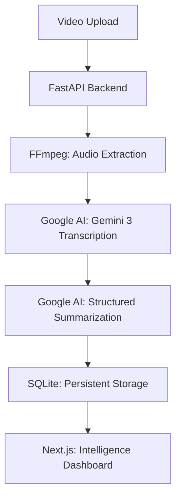

# MeetCapsule AI 🧠

MeetCapsule is a high-performance meeting intelligence platform that transforms video recordings into structured, actionable insights. Powered by the latest **Gemini 3 Flash Preview**, it handles long-form meetings (1hr+) with ease, providing word-for-word transcription and deep-dive technical summaries.

## 🚀 Key Features

- **Gemini 3 Powered**: Utilizes the latest `gemini-3-flash-preview` for near-instant transcription and reasoning.
- **Multimodal Intelligence**: Processes audio directly through Google AI's File API for superior accuracy.
- **Detailed 400-Word Summaries**: Automatically identifies main topics, technical concepts, analogies, and action items.
- **Persistent Vault**: Saves every meeting to a local SQLAlchemy database for easy retrieval.
- **Glassmorphism UI**: A modern Next.js dashboard with live processing feedback and markdown rendering.
- **Dockerized Architecture**: Deploy the entire stack (FastAPI + Next.js + DB) with one command.

## 🏗️ System Architecture



## 🛠️ Tech Stack

- **Frontend**: Next.js 15, React 19, Framer Motion, React-Markdown
- **Backend**: FastAPI, FFmpeg, SQLAlchemy
- **AI Engine**: Google GenAI SDK (`gemini-3-flash-preview`)
- **DevOps**: Docker, Docker Compose

## 🚦 Getting Started

### 1. Prerequisites
- [Docker Desktop](https://www.docker.com/products/docker-desktop/) installed.
- A Gemini API Key from [Google AI Studio](https://aistudio.google.com/).

### 2. Environment Configuration
Create a `.env` file in the `backend/` directory:

```env
GEMINI_API_KEY=your_gemini_api_key_here
```

### 3. Launch with Docker
From the project root, run:

```bash
docker-compose up --build
```

- **Frontend**: http://localhost:3000
- **Backend API**: http://localhost:8000

## 📁 Project Structure

```text
MeetCapsule/
├── backend/
│   ├── scripts/          # AI Processing Engine (Processor.py)
│   ├── data/             # Persistent SQLite Storage
│   ├── main.py           # FastAPI Application
│   └── models.py         # Database Schema
├── frontend/
│   ├── app/              # Next.js Dashboard
│   └── public/           # Static Assets
└── docker-compose.yml    # Full Stack Orchestration
```

## 📄 License
MIT License - Developed by [Your Name/Github Handle]
